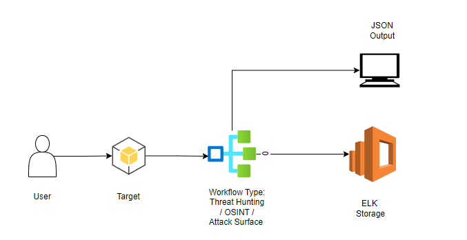

# KOIOS
My Collection of OSINT Scripts. 

Some are wrapped around other tools and other are implemented by me. At end its JSON output and stored somewhere 😁

------------------- 
`Project is Still being Developed and Will share the full architecture and usage`

## Architecture 

## Tools Used
### OSINT / Information Gathering
|Tool|API|Comments|
|----|----|-------|
|Chaos| API Key Required| |
|AbuseIP DB |API Key Required| |
|IP Qualtiy Score |API Key Required| |
|Alien Vault OTX | API Key Required | |
|Virus Total | API Key Required | |

### Attack Surface Management
|Tool| API | Comment|
|----|----|-------|
| Sub Finder | | Built in Tool|
|Chaos |API Key Required | |

### Threat Hunting

## Containers Deployed
1) Portainer (Container Management)
2) Elastic 
3) Kibana
4) Active Pieces (Workflow Management)